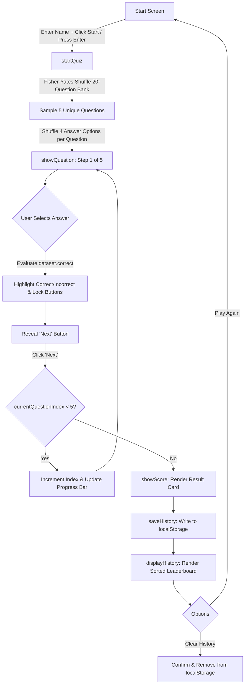

# Interactive Quiz Application

A responsive, lightweight, dependency-free Single Page Application (SPA) built with Vanilla JavaScript, HTML5, and CSS3. The application dynamically samples 5 randomized questions from a 20-question curated bank, evaluates responses in real time, provides visual progress metrics, and persists performance history locally in the browser.

---

## Table of Contents

- [Project Overview](#project-overview)
- [Key Features](#key-features)
- [Technologies Used](#technologies-used)
- [How the Quiz Works](#how-the-quiz-works)
  - [20-Question Master Question Bank](#1-20-question-master-question-bank)
  - [Dynamic 5-Question Sampling](#2-dynamic-5-question-sampling)
  - [Answer Choice Randomization](#3-answer-choice-randomization)
  - [Question Tracker](#4-question-tracker)
  - [Dynamic Progress Bar](#5-dynamic-progress-bar)
  - [Score & Performance Evaluation](#6-score--performance-evaluation)
  - [Persistent History via LocalStorage](#7-persistent-history-via-localstorage)
- [Project Structure](#project-structure)
- [How to Run the Project](#how-to-run-the-project)
- [Screenshots](#screenshots)
- [Future Improvements](#future-improvements)
- [Author](#author)

---

## Project Overview

This project was developed as a clean-architecture demonstration of core frontend engineering principles without relying on third-party libraries, bundlers, or heavy UI frameworks. It features an interactive quiz session that tests users on world geography and general science trivia, offering an engaging user experience through real-time feedback, randomized gameplay, and persistent leaderboard tracking.

---

## Key Features

- **Dynamic Quiz Engine**: Every attempt randomly selects 5 unique questions from an expanded 20-question master pool—ensuring high replayability.
- **Bi-Level Randomization**: Implements the Fisher-Yates shuffle algorithm on both question order and answer option order while preserving correct answer bindings.
- **Visual Progress Metrics**: Features an uppercase step tracker (`Question X of 5`) and a real-time progress bar that scales from `20%` to `100%`.
- **Immediate Visual Feedback**: Choices highlight immediately upon selection (green for correct, red for incorrect), automatically reveal the correct answer if a mistake is made, and lock option buttons to prevent multiple submissions.
- **Comprehensive Score Dashboard**: Displays the final score out of 5, computed percentage, and an animated colored performance bar.
- **Persistent Quiz History**: Stores user attempts in the browser's `localStorage`, presenting an automatically sorted leaderboard (highest scores first) with timestamped records.
- **History Management**: Includes a "Clear History" button backed by a confirmation dialog to safely manage local storage.
- **Security Best Practices**: Neutralizes Cross-Site Scripting (XSS) risks by sanitizing user names and utilizing safe DOM insertion methods (`textContent` and HTML escaping).
- **Keyboard Accessibility**: Start screen supports instant submission via the `Enter` key alongside inline input validation.

---

## Technologies Used

- **HTML5**: Semantic document layout, accessible forms, and modular container design.
- **CSS3**: Modern styling utilizing linear gradients, card elevation (`box-shadow`), custom progress indicators, responsive flexbox alignment, and smooth transitions.
- **Vanilla JavaScript (ES6+)**:
  - Unbiased Fisher-Yates (Knuth) shuffling algorithm.
  - Event-driven architecture with clean `addEventListener` bindings.
  - Efficient DOM manipulation using `DocumentFragment` to eliminate rendering bottlenecks.
  - Web Storage API (`localStorage`) for client-side persistence.

---

## How the Quiz Works



### 1. 20-Question Master Question Bank
The project maintains a curated master question bank consisting of 20 world geography and natural science trivia questions. Each question contains 4 multiple-choice answers with exactly one verified correct answer.

### 2. Dynamic 5-Question Sampling
Rather than presenting the entire bank, each quiz attempt calls:
```javascript
const selectedQuestions = shuffleArray(questions).slice(0, QUIZ_LENGTH);
```
This randomly samples a subset of exactly 5 non-repeating questions without altering the original master list.

### 3. Answer Choice Randomization
Each selected question has its answers array shuffled independently:
```javascript
activeQuestions = selectedQuestions.map(q => ({
    ...q,
    answers: shuffleArray(q.answers)
}));
```
Correct answer flags (`dataset.correct = true`) remain associated with the correct button regardless of position.

### 4. Question Tracker
Located directly above the question header, the tracker updates dynamically:
- Question 1 of 5
- Question 2 of 5
- ...
- Question 5 of 5

### 5. Dynamic Progress Bar
The active quiz container features a sleek progress bar positioned at the top of the card that scales in 20% intervals:
$$\text{Progress} = \left(\frac{\text{Current Question Number}}{5}\right) \times 100\%$$
- Question 1: **20%**
- Question 2: **40%**
- Question 3: **60%**
- Question 4: **80%**
- Question 5: **100%**

### 6. Score & Performance Evaluation
At the end of the 5th question, the application computes:
$$\text{Percentage} = \left(\frac{\text{Score}}{5}\right) \times 100\%$$
Examples:
- $5/5 \rightarrow 100\%$
- $4/5 \rightarrow 80\%$
- $3/5 \rightarrow 60\%$

The result card presents a personalized greeting, the raw fraction, the percentage, and a filled performance visual.

### 7. Persistent History via LocalStorage
Quiz attempts are automatically recorded into `localStorage` under the key `"quizHistory"`:
```json
[
  {
    "name": "Alex",
    "score": 5,
    "total": 5,
    "date": "9/16/2026, 4:27:19 PM"
  }
]
```
The history table sorts all past scores in descending order (`b.score - a.score`) to act as a local leaderboard. A dedicated "Clear History" button with a `confirm()` prompt allows users to reset their local records.

---

## Project Structure

```
quiz-app/
│
├── index.html          # Main HTML entry point containing all single-page views
├── quiz.css            # Stylesheet (layout, card components, buttons, progress bar, table)
├── quiz.js             # Core logic (question bank, shuffle algorithms, DOM events, storage)
└── README.md           # Project documentation and developer guide
```

---

## How to Run the Project

Since the project uses vanilla web standards, it requires no build steps, compilation, or package installations.

### Option 1: Direct File Execution
1. Clone the repository:
   ```bash
   git clone https://github.com/yajnesh26/quiz-app.git
   ```
2. Navigate to the project directory:
   ```bash
   cd quiz-app
   ```
3. Open `index.html` directly in any modern web browser (Google Chrome, Microsoft Edge, Mozilla Firefox, Safari).

### Option 2: Local HTTP Server (Recommended)

Using **Python 3**:
```bash
python -m http.server 8000
```
Open your browser and navigate to `http://localhost:8000`.

Using **Node.js**:
```bash
npx serve .
```

Using **VS Code**:
Install the [Live Server](https://marketplace.visualstudio.com/items?itemName=ritwickdey.LiveServer) extension, right-click `index.html`, and select **Open with Live Server**.

---

## Screenshots

### 1. Start Screen
*User entry screen with name validation and keyboard Enter support.*

```
+-------------------------------------------------------+
|                      Simple Quiz                      |
|                                                       |
|             [ Enter your name               ]         |
|                                                       |
|                    [ Start Quiz ]                     |
+-------------------------------------------------------+
```
*(Screenshot placeholder: `screenshots/start-screen.png`)*

### 2. Active Quiz Screen
*Dynamic progress bar, tracker counter, and randomized choices.*

```
+-------------------------------------------------------+
|                      Simple Quiz                      |
| [====================                             ]   |
| QUESTION 2 OF 5                                       |
| Which is the highest mountain in the world?           |
|                                                       |
| [ A. K2                                     ]         |
| [ B. Mount Everest                          ] (Green) |
| [ C. Kangchenjunga                          ]         |
| [ D. Mount Kilimanjaro                      ]         |
|                                                       |
|                        [ Next ]                       |
+-------------------------------------------------------+
```
*(Screenshot placeholder: `screenshots/quiz-screen.png`)*

### 3. Result Screen & Leaderboard
*Score summary, percentage bar, and persistent history table.*

```
+-------------------------------------------------------+
|                      Simple Quiz                      |
|                                                       |
|             Alex, you scored 5/5                      |
|               Percentage: 100%                        |
| [=================================================]   |
|                                                       |
|                   [ Play Again ]                      |
|                                                       |
|                   📊 Quiz History                     |
| +---------------------------------------------------+ |
| | Name    | Score | Date & Time                     | |
| +---------------------------------------------------+ |
| | Alex    | 5/5   | 9/16/2026, 4:27:19 PM           | |
| +---------------------------------------------------+ |
|                 [ Clear History ]                     |
+-------------------------------------------------------+
```
*(Screenshot placeholder: `screenshots/result-screen.png`)*

---

## Future Improvements

- [ ] **Custom Category & Difficulty Selection**: Allow players to choose categories (Geography, Science, History) and difficulty levels.
- [ ] **Countdown Timer**: Introduce an optional per-question or per-quiz countdown timer for increased challenge.
- [ ] **Audio & Visual Effects**: Add subtle celebratory sound effects and celebratory confetti animations upon achieving a perfect score.
- [ ] **REST API Integration**: Connect to external trivia endpoints (e.g. Open Trivia Database API) for infinite questions.
- [ ] **Backend Cloud Leaderboard**: Implement a Node.js/Express backend with MongoDB/PostgreSQL for global multiplayer leaderboards.

---

## Author

**Yajnesh**
- GitHub: [@yajnesh26](https://github.com/yajnesh26)
- Repository: [yajnesh26/quiz-app](https://github.com/yajnesh26/quiz-app)
