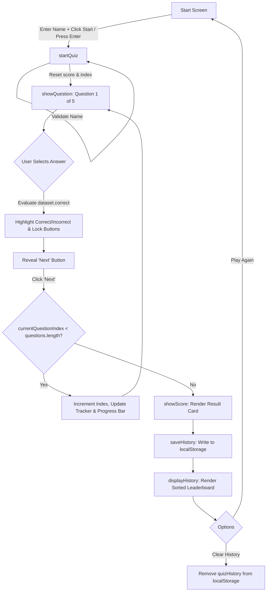

# Interactive Quiz Application

A responsive, lightweight, dependency-free Single Page Application (SPA) built with Vanilla JavaScript, HTML5, and CSS3. The application presents a 5-question trivia quiz, evaluates responses in real time, provides visual progress metrics, and persists performance history locally in the browser.

---

## Table of Contents

- [Project Overview](#project-overview)
- [Key Features](#key-features)
- [Technologies Used](#technologies-used)
- [How the Quiz Works](#how-the-quiz-works)
  - [The Question Bank](#1-the-question-bank)
  - [Quiz Flow](#2-quiz-flow)
  - [Question Tracker](#3-question-tracker)
  - [Progress Bar](#4-progress-bar)
  - [Answer Feedback](#5-answer-feedback)
  - [Score & Performance Evaluation](#6-score--performance-evaluation)
  - [Persistent History via LocalStorage](#7-persistent-history-via-localstorage)
- [Project Structure](#project-structure)
- [How to Run the Project](#how-to-run-the-project)
- [Security](#security)
- [Future Improvements](#future-improvements)
- [Author](#author)

---

## Project Overview

This project is a clean demonstration of core frontend engineering principles without relying on third-party libraries, bundlers, or heavy UI frameworks. It features an interactive quiz session that tests users on world geography and general trivia, offering real-time feedback, a progress bar, and a locally persisted leaderboard.

---

## Key Features

- **Start Screen with Validation**: Users enter a name; the start button validates the input and shows an inline error if it is empty. Pressing `Enter` in the name field starts the quiz.
- **Sequential Quiz Engine**: A fixed bank of 5 questions is presented in order, one at a time, with 4 answer choices each. Questions and answers are shown in their stored order (no shuffling).
- **Visual Progress Metrics**: A `Question X of 5` tracker and a real-time progress bar that scales with the current question number.
- **Immediate Visual Feedback**: Choices highlight immediately upon selection (green for correct, red for incorrect), the correct answer is revealed if a mistake is made, and option buttons are locked to prevent multiple submissions.
- **Score Dashboard**: Displays the final score out of 5, the computed percentage, and a filled colored performance bar.
- **Persistent Quiz History**: Stores user attempts in the browser's `localStorage`, presenting a leaderboard sorted by score (highest first) with timestamped records. Equally scored attempts are ordered newest first.
- **History Management**: A "Clear History" button wipes the stored leaderboard and stays available on the results screen.
- **Safe User Input**: The username is rendered with `textContent` rather than HTML, preventing stored cross-site scripting (XSS) attacks.

---

## Technologies Used

- **HTML5**: Semantic document layout, accessible forms, and modular container design.
- **CSS3**: Modern styling utilizing linear gradients, card elevation (`box-shadow`), custom progress indicators, and smooth transitions.
- **Vanilla JavaScript (ES6+)**:
  - Event-driven architecture with clean `addEventListener` bindings.
  - Safe DOM manipulation using `textContent` for user-controlled text.
  - Web Storage API (`localStorage`) for client-side persistence.

---

## How the Quiz Works



### 1. The Question Bank

The question bank is a hardcoded array of **5** questions stored in `quiz.js`. Each question has 4 multiple-choice answers with exactly one verified correct answer. All 5 questions are used in every attempt, in their stored order; answers are also presented in their stored order.

### 2. Quiz Flow

1. The user enters a name and clicks **Start Quiz** (or presses `Enter`). Empty input shows an inline error.
2. `startQuiz()` resets the score and question index, then calls `showQuestion()`.
3. Each question renders 4 answer buttons. Selecting one marks it correct/incorrect, reveals the correct answer, disables all buttons, and shows the **Next** button.
4. The **Next** button advances to the following question. After the last question, `showScore()` renders the result and leaderboard.
5. **Play Again** reloads the page back to the start screen.

### 3. Question Tracker

Located directly above the question header, the tracker updates dynamically:

- Question 1 of 5
- Question 2 of 5
- ...
- Question 5 of 5

### 4. Progress Bar

The progress bar fills based on the current question number and the total question count:

$$\text{Progress} = \left(\frac{\text{Question Number}}{\text{Total Questions}}\right) \times 100\%$$

- Question 1: **20%**
- Question 2: **40%**
- Question 3: **60%**
- Question 4: **80%**
- Question 5: **100%**

### 5. Answer Feedback

When an answer is chosen, the selected button turns green (correct) or red (incorrect). The correct answer is always highlighted after selection, all buttons are disabled, and the Next button appears.

### 6. Score & Performance Evaluation

At the end of the quiz the application computes:

$$\text{Percentage} = \left(\frac{\text{Score}}{\text{Total Questions}}\right) \times 100\%$$

Examples:
- $5/5 \rightarrow 100\%$
- $4/5 \rightarrow 80\%$
- $3/5 \rightarrow 60\%$

The result card presents a personalized greeting, the raw fraction, the percentage, and a filled performance bar.

### 7. Persistent History via LocalStorage

Quiz attempts are automatically recorded into `localStorage` under the key `"quizHistory"`:

```json
[
  {
    "name": "Alex",
    "score": 5,
    "total": 5,
    "date": "9/16/2026, 4:27:19 PM",
    "timestamp": 1726493239000
  }
]
```

- The `timestamp` field (ms since epoch) is used only for ordering; `date` is the human-readable label.
- The history table sorts all attempts in descending score order (`b.score - a.score`); when scores are equal, newest attempts (highest `timestamp`) appear first.
- A **Clear History** button removes the `"quizHistory"` key and immediately re-renders the (now empty) history section.

---

## Project Structure

```
quiz-app/
│
├── index.html          # Main HTML entry point containing all single-page views
├── quiz.css            # Stylesheet (layout, card components, buttons, progress bar, table)
├── quiz.js             # Core logic (question bank, DOM events, scoring, storage)
└── README.md           # Project documentation and developer guide
```

---

## How to Run the Project

Since the project uses vanilla web standards, it requires no build steps, compilation, or package installations.

### Option 1: Direct File Execution

1. Clone the repository:
   ```bash
   git clone https://github.com/yajnesh26/quiz-app.git
   ```
2. Navigate to the project directory:
   ```bash
   cd quiz-app
   ```
3. Open `index.html` directly in any modern web browser (Google Chrome, Microsoft Edge, Mozilla Firefox, Safari).

### Option 2: Local HTTP Server (Recommended)

Using **Python 3**:
```bash
python -m http.server 8000
```
Open your browser and navigate to `http://localhost:8000`.

Using **Node.js**:
```bash
npx serve .
```

Using **VS Code**:
Install the [Live Server](https://marketplace.visualstudio.com/items?itemName=ritwickdey.LiveServer) extension, right-click `index.html`, and select **Open with Live Server**.

---

## Security

- The username is always rendered with `textContent`, so a name containing HTML or scripts is displayed as plain text and cannot execute. This prevents both reflected and stored XSS via the result card and the history leaderboard.
- No third-party code, libraries, or build tools are used.

---

## Future Improvements

- [ ] **Custom Category & Difficulty Selection**: Allow players to choose categories (Geography, Science, History) and difficulty levels.
- [ ] **Question & Answer Shuffling**: Randomize question order and answer option order for higher replayability.
- [ ] **Countdown Timer**: Introduce an optional per-question or per-quiz countdown timer for increased challenge.
- [ ] **Audio & Visual Effects**: Add subtle celebratory sound effects and celebratory confetti animations upon achieving a perfect score.
- [ ] **REST API Integration**: Connect to external trivia endpoints (e.g. Open Trivia Database API) for infinite questions.
- [ ] **Backend Cloud Leaderboard**: Implement a Node.js/Express backend with MongoDB/PostgreSQL for global multiplayer leaderboards.

---

## Author

**Yajnesh**
- GitHub: [@yajnesh26](https://github.com/yajnesh26)
- Repository: [yajnesh26/quiz-app](https://github.com/yajnesh26/quiz-app)